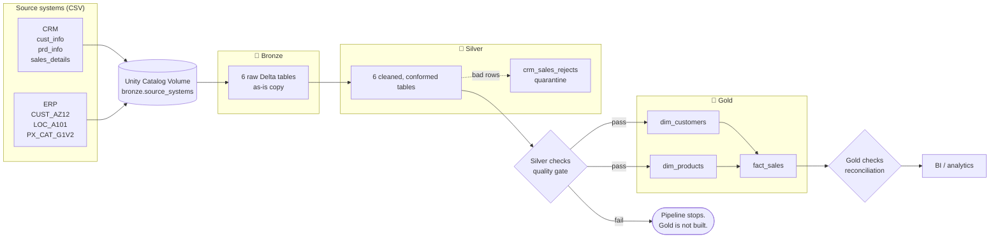
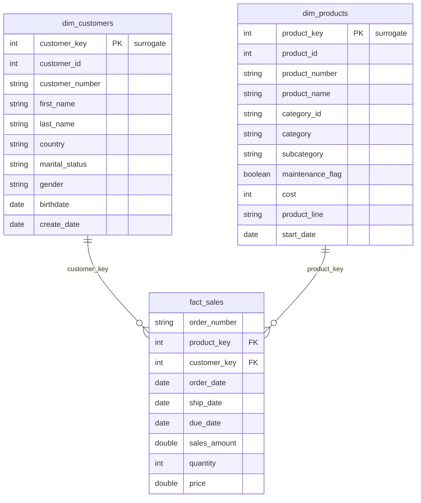

# 🚲 Bike Data Lakehouse


An end-to-end data lakehouse on **Databricks** that takes raw extracts from two operational systems of a bicycle retailer, a **CRM** and an **ERP**, and turns them into a **tested star schema** ready for BI and analytics.

It follows the **Medallion Architecture** (Bronze → Silver → Gold), is written in **PySpark and Spark SQL**, stores every layer as **Delta tables** governed by **Unity Catalog**, and runs end to end from a single notebook that a Databricks Job can schedule.

The transformations are the easy part. What this project really focuses on is what happens when the data is wrong:

- a **quality gate** between Silver and Gold that stops the pipeline instead of publishing bad numbers,
- a **quarantine table** so rejected rows are kept with a reason instead of disappearing,
- **reconciliation checks** that prove Gold still adds up to Silver after the model is built.

---

## 🏗️ Architecture



| Layer | Schema | Responsibility | Load pattern |
|---|---|---|---|
| 🥉 **Bronze** | `workspace.bronze` | Land the source files exactly as received. No business logic. | Full overwrite |
| 🥈 **Silver** | `workspace.silver` | Clean, standardise, reconcile keys across systems, quarantine what cannot be fixed. | Full overwrite |
| 🥇 **Gold** | `workspace.gold` | Business model: a star schema with surrogate keys, built only from validated Silver data. | Full overwrite |

---

## 📥 Source Data

Six CSV extracts from two systems, in [`datasets/`](datasets):

| System | File | Rows | Grain | Silver table |
|---|---|---:|---|---|
| CRM | `cust_info.csv` | 18,493 | one row per customer record (contains duplicates) | `crm_customers` |
| CRM | `prd_info.csv` | 397 | one row per product **version** (price history) | `crm_products` |
| CRM | `sales_details.csv` | 60,398 | one row per order line | `crm_sales` |
| ERP | `CUST_AZ12.csv` | 18,483 | one row per customer (birthdate, gender) | `erp_customers` |
| ERP | `LOC_A101.csv` | 18,484 | one row per customer (country) | `erp_customer_location` |
| ERP | `PX_CAT_G1V2.csv` | 36 | one row per product category | `erp_product_category` |

### The integration problem

The two systems describe the same customers and products, but **they do not agree on keys**. Most of the Silver work comes down to making them join:

| Entity | CRM key | ERP key | Fix applied in Silver |
|---|---|---|---|
| Customer | `AW00011000` | `NASAW00011000` | Remove the `NAS` prefix |
| Customer location | `AW00011000` | `AW-00011000` | Remove the `-` |
| Product category | `CO-RF-FR-R92B-58` (embedded) | `CO_RF` | Split `prd_key`: first 5 characters with `-` → `_` become `category_id`, the rest becomes `product_number` |

---

## 🥉 Bronze Layer

[`script/Bronze/Bronze_layer.ipynb`](script/Bronze/Bronze_layer.ipynb)

- **Config-driven ingestion.** One `INGESTION_CONFIG` list maps each file to its target table. Onboarding a new file means adding one line, not writing a new notebook.
- **No transformations.** Bronze is the raw record. If a Silver rule turns out to be wrong, Silver can be rebuilt from Bronze without going back to the source systems.
- Reads CSVs from the Unity Catalog Volume `/Volumes/workspace/bronze/source_systems` and writes Delta tables named `bronze.<system>_<entity>`.

---

## 🥈 Silver Layer

One notebook per source table, under [`script/Silver/`](script/Silver). Every notebook follows the same shape: **read Bronze → trim → fix → rename → write → quick sanity check.** That consistency matters more than it looks, because anyone who has read one notebook can read all six.

| Notebook | Key rules |
|---|---|
| `crm/silver_crm_cust_info` | Decode marital status and gender (`M`/`S`/`F` → words). Drop rows with no `customer_id`. **Deduplicate** with `ROW_NUMBER()` and keep the newest record per customer. |
| `crm/silver_crm_prd_info` | Split `prd_key` into `category_id` and `product_number`. Null cost → `0`. Decode product line. **Rebuild `end_date`** with `LEAD()`: the source end dates are unreliable (some end before they start), so each version now ends the day before the next one begins, and the latest version has no end date. |
| `crm/silver_crm_sales_details` | Convert `yyyyMMdd` integers to dates (invalid values become `NULL`). Recompute a missing or non-positive **price** as `sales / quantity`. Recompute **sales** whenever it is missing, non-positive, or `≠ quantity × price`. **Quarantine** any row whose customer or current product does not exist. |
| `erp/silver_erp_cust_az12` | Remove the `NAS` prefix from IDs. Future birthdates → `NULL`. Standardise gender. |
| `erp/silver_erp_loc_a101` | Remove `-` from IDs. Standardise country (`DE` → Germany, `US`/`USA` → United States, blank → `n/a`). |
| `erp/silver_erp_px_cat_g1v2` | Maintenance flag `Yes`/`No` → boolean. |

### Quarantine instead of drop

Sales that cannot be tied to a known customer or a current product are **not silently filtered out**. They are written to `silver.crm_sales_rejects` with a `reject_reason` (`customer_not_found`, `product_not_found`, `amount_cannot_be_fixed`; a row can have more than one) and a `rejected_at` timestamp. The good rows flow on, and the bad ones stay available for investigation or reprocessing.

---

## 🥇 Gold Layer: Star Schema



| Table | Built from | Notes |
|---|---|---|
| `gold.dim_customers` | CRM customers + ERP customers + ERP locations | CRM is the system of record. ERP **gender** is used only when CRM has none. `LEFT JOIN`s keep every CRM customer even if ERP has no match. |
| `gold.dim_products` | CRM products + ERP categories | **Current version only** (`end_date IS NULL`), so there is exactly one row per product. Without this filter, the fact table's join multiplies sales rows. |
| `gold.fact_sales` | Silver sales + both dimensions | Natural keys are swapped for surrogate keys. Built **last**, after both dimensions. |

---

## ✅ Data Quality

Quality is enforced at two points, and each has a different job.

### 1. Silver checks: the gate

[`script/Silver/silver_checks.ipynb`](script/Silver/silver_checks.ipynb) runs **before** Gold. Any failure raises an assertion, the job fails, and **Gold is not rebuilt**, so consumers keep reading the last good version rather than a broken one.

| Check | Protects against |
|---|---|
| No duplicate `customer_id` in `crm_customers` | Fan-out when joining to the customer dimension |
| Every product has **exactly one** current row | Duplicate fact rows from a many-to-many product join |
| Every sale's `customer_id` exists in customers | Orphaned facts / null foreign keys |
| Every sale's `product_number` exists as a **current** product | Orphaned facts / null foreign keys |
| `sales_amount = quantity × price` on every row | Revenue figures that don't add up |

### 2. Gold checks: reconciliation

[`script/Gold/gold_checks.ipynb`](script/Gold/gold_checks.ipynb) runs **after** Gold and proves the dimensional model didn't lose or duplicate anything on the way:

- `fact_sales` row count **equals** `silver.crm_sales`
- `SUM(sales_amount)` in Gold **equals** Silver

---

## ⚙️ Orchestration

[`script/run_all_pipeline.ipynb`](script/run_all_pipeline.ipynb) is the single entry point and the notebook to schedule as a **Databricks Job**:

```
Bronze_layer
  → silver_orchestration   (customers, products, then sales, then the ERP tables)
  → silver_checks          ← GATE
  → gold_orchestration     (dim_customers, dim_products, then fact_sales)
  → gold_checks
```

The run order is fixed where there are real dependencies: sales validation needs customers and products to exist, and the fact table needs both dimensions. Each layer also has its own orchestration notebook, so a single layer can be re-run on its own while debugging.

---

## 🚀 Getting Started

**Prerequisites:** a Databricks workspace with Unity Catalog (the code targets the default `workspace` catalog, e.g. Databricks Free Edition).

1. **Import** the `script/` folder into your Databricks workspace, keeping the folder structure (orchestration uses relative paths).
2. **Run** [`script/init_lakehouse.ipynb`](script/init_lakehouse.ipynb) once. It creates the `bronze`, `silver` and `gold` schemas and the `bronze.source_systems` Volume.
3. **Upload** `datasets/source_crm` and `datasets/source_erp` into that Volume, so the paths look like `/Volumes/workspace/bronze/source_systems/source_crm/cust_info.csv`.
4. **Run** [`script/run_all_pipeline.ipynb`](script/run_all_pipeline.ipynb), or create a Job that points at it.
5. **Query** the model:

```sql
SELECT c.country,
       p.category,
       SUM(f.sales_amount) AS revenue
FROM   workspace.gold.fact_sales    f
JOIN   workspace.gold.dim_customers c ON f.customer_key = c.customer_key
JOIN   workspace.gold.dim_products  p ON f.product_key  = p.product_key
GROUP  BY c.country, p.category
ORDER  BY revenue DESC;
```

To use a different catalog, change `CATALOG` at the top of each notebook and the `USE CATALOG` line in `init_lakehouse`.

---

## 📁 Repository Structure

```
Bike-Data-Lakehouse/
├── datasets/
│   ├── source_crm/          cust_info.csv, prd_info.csv, sales_details.csv
│   └── source_erp/          CUST_AZ12.csv, LOC_A101.csv, PX_CAT_G1V2.csv
└── script/
    ├── init_lakehouse.ipynb          one-time setup: schemas + volume
    ├── run_all_pipeline.ipynb        end-to-end entry point
    ├── Bronze/
    │   └── Bronze_layer.ipynb
    ├── Silver/
    │   ├── crm/                      customers, products, sales (+ rejects)
    │   ├── erp/                      customers, locations, categories
    │   ├── silver_orchestration.ipynb
    │   └── silver_checks.ipynb       quality gate
    └── Gold/
        ├── gold_dim_customers.ipynb
        ├── gold_dim_products.ipynb
        ├── gold_fact_sales.ipynb
        ├── gold_orchestration.ipynb
        └── gold_checks.ipynb         reconciliation
```

---

## 🧭 Design Decisions

- **Bronze stays raw.** Business rules change. Keeping an untouched copy means any Silver or Gold table can be rebuilt without asking the source teams for another extract.
- **Fail closed, not open.** A pipeline that publishes wrong revenue is worse than one that publishes nothing, which is why the Silver gate aborts the run instead of logging a warning and carrying on.
- **Quarantine over filter.** A filtered row is a silent data loss. A rejected row with a reason can be counted, explained to the business, and reprocessed.
- **CRM is the system of record for customers.** ERP only fills gaps (gender). The precedence is written into the SQL explicitly rather than left to join order.
- **Rebuild history instead of trusting it.** The product end dates in the source are inconsistent, so validity windows are derived from the start dates, which is the one column that can be trusted.

---

## 🔭 Limitations & Roadmap

This is a batch, full-refresh pipeline, which is the right trade-off for this data volume. These are the things I would change before running it against production-scale data:

| Area | Today | Next step |
|---|---|---|
| Load pattern | Every layer is overwritten on each run | Incremental loads with Auto Loader in Bronze and `MERGE` into Silver |
| Surrogate keys | `ROW_NUMBER()` at build time, so keys can change between runs | Delta `IDENTITY` columns or hashed business keys, for keys that stay stable over time |
| Product history | Gold keeps only the current product version (SCD Type 1) | SCD Type 2 dimension with a date-range join, so historical sales link to the product version that was actually sold |
| Bronze schema | `inferSchema` on CSV | Explicit schemas plus rescued-data columns to catch schema drift at the edge |
| Data quality | Hand-written assertions in notebooks | Lakeflow Declarative Pipelines expectations, or a framework like Great Expectations, with results stored for trend monitoring |
| Orchestration | `dbutils.notebook.run` chain | A Lakeflow Jobs task graph so independent Silver tables run in parallel, packaged with Databricks Asset Bundles for CI/CD |
| Testing | None outside the pipeline checks | Unit tests for the transformation functions, run in CI |

---

## 🙏 Acknowledgements

The dataset and the project brief come from the [**Databricks Bootcamp 2026**](https://github.com/DataWithBaraa/databricks_bootcamp_2026) by **Data With Baraa**. On top of that reference, this repository adds the sales quarantine table, the Silver quality gate, the Gold reconciliation checks and the end-to-end pipeline runner.

## 👤 Author

**Vinay Talaviya** · [GitHub @vinay4955](https://github.com/vinay4955)
