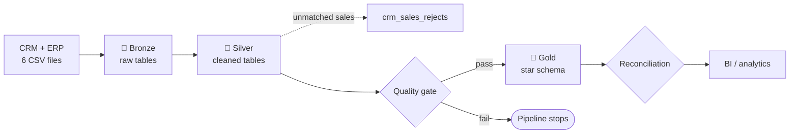
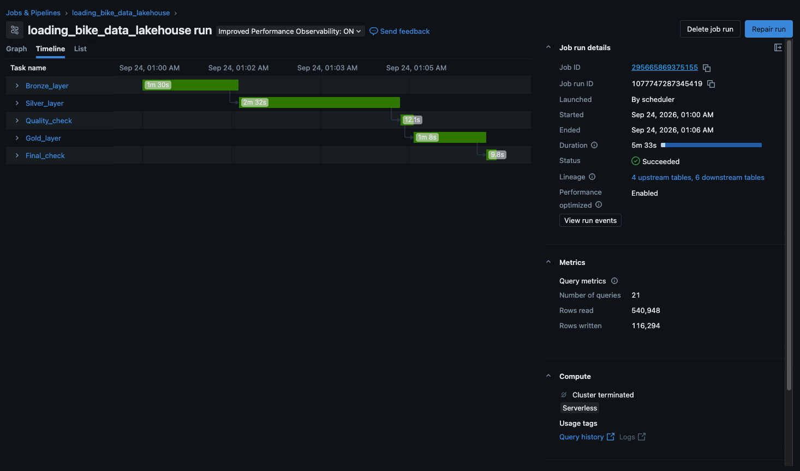
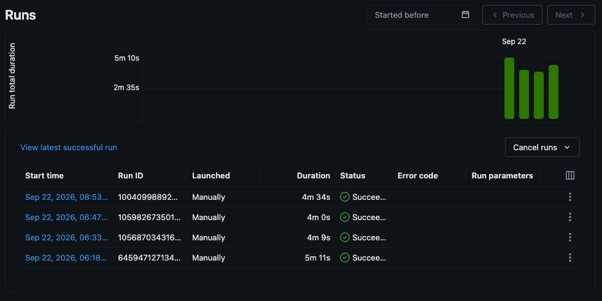

# 🚲 Bike Data Lakehouse


A Databricks lakehouse that turns raw CRM and ERP data from a bike retailer into a tested star schema for analytics. Built with PySpark and Spark SQL on Delta tables in Unity Catalog, using the Medallion Architecture.

Bad data is handled in three ways:

- **Quality gate:** Gold is built only if Silver passes its checks.
- **Quarantine:** sales that can't be matched or repaired go to a rejects table with the reason.
- **Reconciliation:** Gold row counts and sales totals must match Silver.

## 🏗️ Architecture



| Layer | What it does |
|---|---|
| 🥉 **Bronze** | Loads the six CSV files as they are. One config list drives every file. |
| 🥈 **Silver** | Cleans each table and matches keys between CRM and ERP. |
| 🥇 **Gold** | Builds `dim_customers` and `dim_products` with surrogate keys plus `fact_sales` that links to them. |

## 🔗 Matching CRM and ERP

The two systems use different keys for the same records. Silver fixes them so they join:

| Entity | CRM | ERP | Fix |
|---|---|---|---|
| Customer | `AW00011000` | `NASAW00011000` | Drop the `NAS` prefix |
| Location | `AW00011000` | `AW-00011000` | Drop the `-` |
| Category | `CO-RF-FR-R92B-58` | `CO_RF` | Take the first five characters and swap `-` for `_` |

Other Silver fixes: duplicate customers keep their newest record. Product end dates are rebuilt from start dates because the source ones are unreliable. Missing or wrong sales prices and amounts are recalculated.

## ✅ Data Quality

**Silver gate** runs before Gold and stops the pipeline if any check fails:

- no duplicate customers
- exactly one current version per product
- every sale has a known customer and product
- `sales_amount = quantity × price`

**Gold checks** confirm that `fact_sales` has the same row count and total sales as Silver.

## ⚙️ Orchestration

The pipeline runs as the Databricks Job `loading_bike_data_lakehouse` with five tasks in sequence:



- **Schedule:** daily at 01:00 (Europe/Berlin).
- **Compute:** serverless with performance optimization on.
- **Source:** notebooks run straight from this GitHub repo.
- **Alerts:** email on start, success and failure.
- **Runtime:** a full run takes about 4 to 5 minutes.



## 🚀 Getting Started

1. Import the `script/` folder into a Databricks workspace.
2. Run `init_lakehouse` once to create the schemas and the Volume.
3. Upload `datasets/source_crm` and `datasets/source_erp` to `/Volumes/workspace/bronze/source_systems/`.
4. Run `run_all_pipeline` once by hand or set up a Job like the one above.

## 📁 Project Structure

```
datasets/          raw CRM and ERP CSV files
script/
├── init_lakehouse       one-time setup
├── run_all_pipeline     runs everything in order
├── Bronze/              raw ingestion
├── Silver/              cleaning notebooks + quality gate
└── Gold/                star schema + reconciliation
```

## 🔭 Next Steps

- Incremental loads with Auto Loader and `MERGE`
- Stable surrogate keys instead of `ROW_NUMBER()`
- SCD Type 2 in `dim_products` (Silver already keeps every product version)
- Explicit Bronze schemas instead of `inferSchema`

## 🙏 Credits

Dataset and project brief from the [Databricks Bootcamp 2026](https://github.com/DataWithBaraa/databricks_bootcamp_2026) by Data With Baraa.
